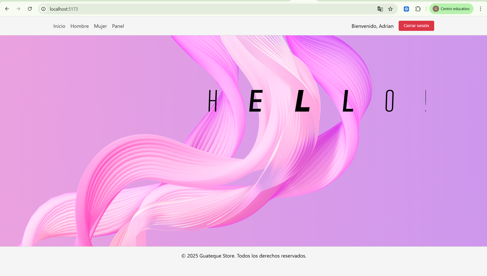
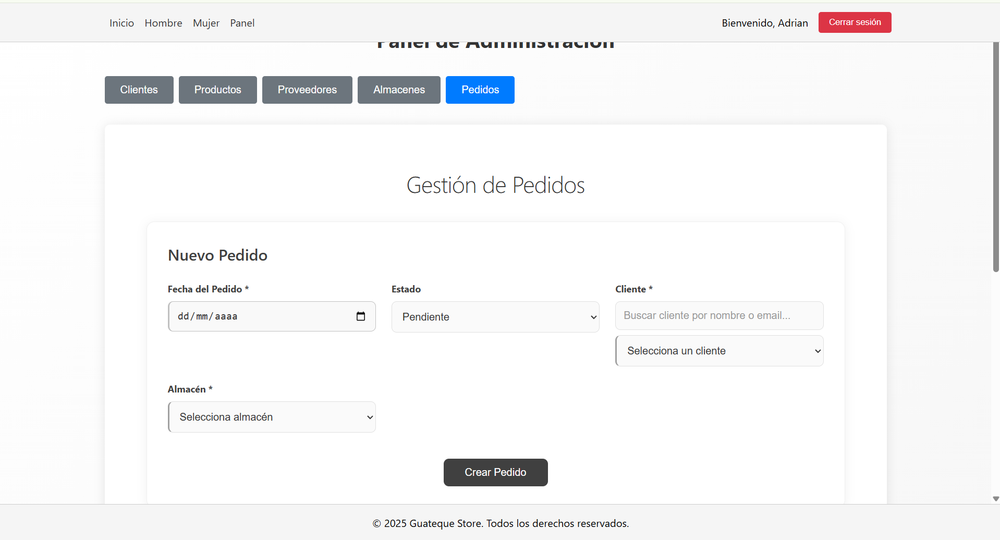

# 🖥️ Frontend - GuatequeStore

**Tienda online de moda sostenible desarrollada con React + Vite**  
Este frontend permite a usuarios explorar productos, gestionar carrito de compras y realizar pedidos. Administradores pueden gestionar productos, proveedores, almacenes y pedidos desde un panel de control completo. Desarrollado como parte de un ecosistema que incluye backend Spring Boot y app móvil Android.

📋 **Estado actual:** Estamos implementando mejoras continuas. Actualmente tenemos un sistema de scroll horizontal para navegar productos, pero estamos evaluando reconstruir esta funcionalidad para mejorar la experiencia de usuario.

## 🎨 Diseño y Experiencia

### ✨ Lo que Hicimos Bien
Hemos creado una interfaz limpia, moderna y totalmente responsiva que refleja los valores de sostenibilidad de GuatequeStore. El diseño sigue fielmente nuestro sistema de diseño en Figma y ofrece una navegación intuitiva.

### 🔄 Áreas de Mejora
Reconocemos que el scroll horizontal implementado para la navegación de productos no ofrece la mejor experiencia de usuario que imaginamos. El equipo está considerando reconstruir esta funcionalidad completamente para implementar una solución más robusta y amigable.

## 🖼️ Demo / Capturas

**Enlace al diseño en Figma:**  
https://www.figma.com/design/vbEG6WmzHaxsk2JROq9KnC/KORA-DESIGN?node-id=1-2381&t=c40bGH3AkG5NkY87-1

  
*Pantalla principal de Guateque Store*

  
*Dashboard administrativo con gestión de productos*

## 📁 Estructura del Proyecto

```
GuatequeStore/
├── Android/                 # Aplicación móvil en Java
│   ├── app/                 # Código fuente de Android
│   └── build/               # Archivos de compilación
├── Frontend/                # Aplicación web en React
│   ├── public/              # Archivos estáticos (imágenes, favicon, etc.)
│   ├── src/                 # Código fuente principal
│   │   ├── assets/          # Imágenes, fuentes, etc.
│   │   ├── components/      # Componentes reutilizables
│   │   ├── pages/           # Páginas principales
│   │   ├── styles/          # Archivos CSS/SCSS
│   │   ├── App.jsx          # Componente raíz
│   │   └── main.jsx         # Punto de entrada
│   ├── index.html           # Template HTML
│   ├── package.json         # Dependencias y scripts
│   ├── vite.config.js       # Configuración de Vite
│   └── eslint.config.js     # Reglas de linting
├── Backend/                 # API y lógica del servidor en Java + Spring Boot
│   ├── src/                 # Código fuente
│   ├── pom.xml              # Dependencias y configuración Maven/Gradle
│   └── application.properties # Configuración del servidor
└── README.md                # Documentación general del proyecto
```

## 🛠️ Tecnologías Usadas

- **React 18** – Biblioteca principal para interfaces de usuario
- **Vite 5** – Herramienta de build y desarrollo de alta velocidad
- **React Router DOM 6** – Enrutamiento y navegación
- **Axios 1.6** – Cliente HTTP para comunicación con APIs
- **npm 9+** – Gestor de paquetes
- **ESLint 8** – Análisis estático de código
- **CSS Modules** – Estilos con alcance local por componente

## 📋 Requisitos Previos

- **Node.js 18** o superior
- **npm 9** o superior
- **Backend de Guateque Store** ejecutándose localmente en puerto 8080
- **MySQL** para la base de datos (gestión mediante backend)
- **Git** para clonar el repositorio

## 🚀 Instalación

### 1. Clonar el Repositorio

```bash
git clone https://github.com/Adrianbien43/GuatequeStore.git
cd GuatequeStore/Frontend
```

### 2. Instalar Dependencias

```bash
npm install
```

### 3. Configurar Variables de Entorno

Crear archivo `.env` en la raíz del proyecto con las variables necesarias (ver sección siguiente).

### 4. Ejecutar la Aplicación

**Modo desarrollo:**
```bash
npm run dev
```
La aplicación estará disponible en `http://localhost:5173`

**Build de producción:**
```bash
npm run build
```

**Previsualizar build de producción:**
```bash
npm run preview
```

## 🔧 Variables de Entorno

Crear un archivo `.env` en la raíz del proyecto con las siguientes variables:

```env
VITE_API_URL=http://localhost:8080/api
```

**Descripción:**
- `VITE_API_URL`: URL base del backend de Guateque Store. Debe apuntar a la API REST que proporciona los endpoints para productos, clientes, proveedores, etc.

## 📄 Licencia

Este proyecto está bajo la licencia **MIT**. Consulta el archivo LICENSE para más detalles.

## 👥 Autor / Contacto

**Proyecto desarrollado por:**
- Gorka Jesús Quesada Vega – Desarrollo Frontend/Backend
- Adrián Bienvenido Morales – Desarrollo Backend/Base de Datos  
- Manuel Cruz Sánchez – Desarrollo Frontend/Diseño

**Repositorio:** https://github.com/Adrianbien43/GuatequeStore.git  
**Rama principal del backend:** `backend-Adrian`