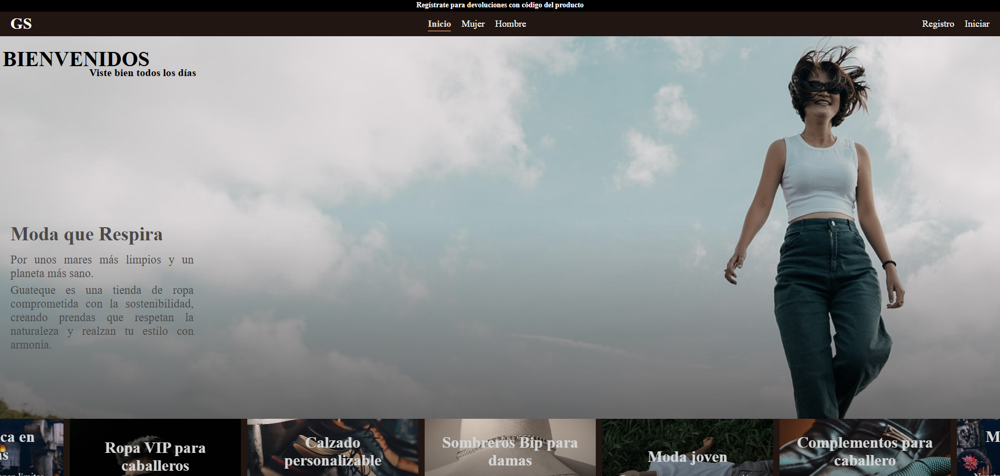
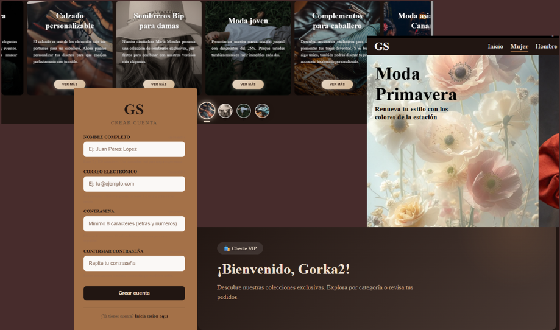
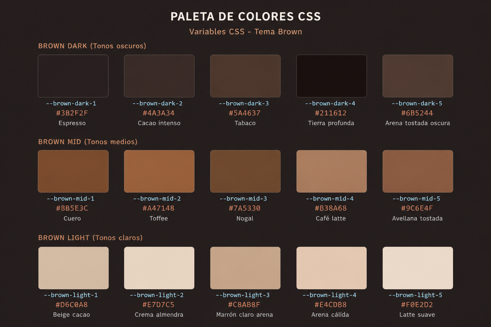

# 🛍️ GuatequeStore - Frontend

<div align="center">

  

  <div style="position: relative; margin-top: -180px; padding: 20px; background: linear-gradient(to top, rgba(0,0,0,0.8), transparent); border-radius: 0 0 12px 12px;">
    
  <h2 style="color: white; margin: 0; text-shadow: 2px 2px 4px rgba(0,0,0,0.5);">
       Los GuatequeStore - Frontend
    </h2>
    
  <p style="color: #e0e0e0; font-style: italic; margin: 8px 0 16px 0;">
      Interfaz principal de la plataforma GuatequeStore - Inicio de sesión y catálogo
    </p>

  <p>
      <a href="https://react.dev">
        
      </a>
      <a href="https://vitejs.dev">
        
      </a>
      <a href="https://nodejs.org">
        
      </a>
      <a href="LICENSE">
        
      </a>
    </p>

  </div>

</div>

---

## 📄 Descripción del Proyecto

GuatequeStore es una plataforma web de e-commerce profesional enfocada en la gestión y venta de productos de moda, pero con un enfoque más actual y consciente. Está desarrollada utilizando React 19, Vite y Material-UI, lo que permite ofrecer una experiencia de usuario bastante fluida, rápida y bien optimizada, tanto en ordenador como en móvil.

La idea del proyecto no es solo montar una tienda online típica, sino crear algo que sea fácil de usar, accesible y que realmente invite a la gente a interactuar sin complicarse la vida. Vamos, que entras y más o menos sabes por dónde moverte sin tener que pensar demasiado.

### Propósito Principal

Proporcionar una solución completa de comercio electrónico accesible para todo el mundo. Da igual si estás solo o nadie te apoya — esta es tu página para empezar a despegar, mi niño. ¿A qué esperas?

- 👕 **Experiencia cliente**: Catálogo intuitivo, carrito funcional, historial de pedidos
- 🔧 **Panel administrativo**: Gestión de productos, proveedores, inventario y análisis
- 🔐 **Seguridad**: Autenticación JWT, rutas protegidas por roles, validaciones
- 🌱 **Moda responsable**: Programa de reciclaje y economía circular

### 👥 ¿Para quién es GuatequeStore?

**Clientes finales**: Gente de a pie que quiere comprar moda de calidad sin complicaciones. Desde el chaval de La Laguna que busca un look para la uni, hasta la señora de Puerto del Rosario que quiere renovar el armario sin moverse del sofá.

**Administradores**: Emprendedores canarios que necesitan una herramienta potente para gestionar su negocio online. Control total del catálogo, inventario al día y análisis de ventas sin tener que ser ingeniero de la NASA.

**Usuarios móviles**: Porque en Canarias vivimos con el móvil en la mano, ya sea en la guagua, en la playa o en el terrao tomando un café. La app complementaria te sigue donde vayas.

---

## 📋 Tabla de Contenidos

- [Descripción del Proyecto](#descripción-del-proyecto)
- [Estado del Proyecto](#-estado-del-proyecto)
- [Tecnologías Utilizadas](#-tecnologías-utilizadas)
- [Arquitectura y Diseño](#-arquitectura-y-diseño)
- [Instalación](#-instalación)
- [Diseño y UX](#-diseño-y-ux)
- [Accesibilidad](#-accesibilidad)
- [Autenticación y Seguridad](#-autenticación-y-seguridad)
- [Testing](#-testing)
- [Endpoints de API](#-endpoints-de-api)
- [Limitaciones Conocidas](#-limitaciones-conocidas)
- [Autor y Contacto](#-autor-y-contacto)

---

## ✅ Estado del Proyecto

### Funcionalidades Implementadas

| Módulo | Funcionalidad | Estado |
|--------|--------------|--------|
| **Autenticación** | Registro con validación completa | ✅ |
| **Autenticación** | Login con JWT tokens | ✅ |
| **Autenticación** | Gestión de sesiones y logout | ✅ |
| **Autenticación** | Protección de rutas por rol | ✅ |
| **Cliente** | Catálogo filtrable (Hombre/Mujer) | ✅ |
| **Cliente** | Búsqueda y filtrado de productos | ✅ |
| **Cliente** | Carrito de compras funcional | ✅ |
| **Cliente** | Historial de pedidos | ✅ |
| **Cliente** | Programa de reciclaje | ✅ |
| **Admin** | Panel de control con métricas | ✅ |
| **Admin** | CRUD completo de productos | ✅ |
| **Admin** | Gestión de proveedores | ✅ |
| **Admin** | Control de inventario | ✅ |
| **Técnicas** | Diseño responsive mobile-first | ✅ |
| **Técnicas** | Testing automatizado con Vitest | ✅ |
| **Técnicas** | Build optimizado con Vite | ✅ |

### 🔧 Correcciones desde Primera Entrega

| Error Detectado (1ª Entrega) | Solución Aplicada | Estado |
|------------------------------|-------------------|--------|
| El carrito se vaciaba al recargar la página | Implementado `localStorage` para persistencia del carrito | ✅ Corregido |
| No había feedback visual en formularios | Añadidos estados de carga, errores y confirmaciones con MUI `Alert` y `CircularProgress` | ✅ Corregido |
| El responsive se rompía en tablets | Ajustados breakpoints de MUI Grid (`sm`, `md`, `lg`) y tamaños de fuente escalables | ✅ Corregido |
| Los tests no cubrían validaciones de formularios | Añadidos tests unitarios para `registro.validator.js` con casos límite | ✅ Corregido |
| El panel admin no filtraba productos por stock bajo | Implementado endpoint `/api/inventario/bajo-stock/{limite}` y vista filtrada | ✅ Corregido |

**Versión**: 1.0.0  
**Estado**: 🟢 Completo y funcional  
**Última actualización**: Mayo 2026

---

## 🛠️ Tecnologías Utilizadas

| Capa | Tecnología | Versión | Justificación |
|------|-----------|---------|---------------|
| **Core** | React | 19.2.0 | Hooks modernos, rendimiento |
| **Core** | Vite | 7.2.4 | Build rápido, HMR instantáneo |
| **Core** | React Router DOM | 6.30.3 | Enrutamiento declarativo |
| **UI** | Material-UI (MUI) | 7.3.7 | Componentes accesibles listos |
| **UI** | Emotion | ^11.14.0 | CSS-in-JS dinámico |
| **HTTP** | Axios | 1.13.5 | Interceptores para JWT |
| **Testing** | Vitest | 4.0.18 | Integración nativa con Vite |
| **Testing** | React Testing Library | 16.3.2 | Tests orientados a comportamiento |
| **Calidad** | ESLint | 9.39.1 | Código consistente |

---

## 🏗️ Arquitectura y Diseño

### Capas del Proyecto

```
┌─────────────────────────────────────────┐
│  PRESENTACIÓN  →  Components / Pages     │
│  (PrivateRoute, Header, ProductCard...)  │
├─────────────────────────────────────────┤
│  LÓGICA        →  Hooks / Context        │
│  (AuthContext, useAuth, validadores)     │
├─────────────────────────────────────────┤
│  COMUNICACIÓN  →  Axios + Interceptores  │
│  (JWT automático, manejo de errores)     │
├─────────────────────────────────────────┤
│  PERSISTENCIA  →  localStorage           │
│  (token, datos de usuario)               │
└─────────────────────────────────────────┘
```

### Decisiones Técnicas Clave

| Decisión | Alternativa Rechazada | Justificación |
|----------|----------------------|---------------|
| **Context API** | Redux / Zustand | Estado simple, sin overhead |
| **Vite** | Create React App | 10x más rápido, mejor DX |
| **Vitest** | Jest | Integración nativa Vite |
| **Material-UI** | Tailwind | Componentes accesibles de fábrica |
| **Axios** | Fetch API | Interceptores, timeout, retry |

### Estructura de Carpetas

```
Frontend/
├── src/
│   ├── main.jsx                 # Punto de entrada
│   ├── App.jsx                  # Router principal
│   ├── api.js                   # Axios configurado
│   ├── index.css                # Estilos globales
│   ├── components/
│   │   ├── PrivateRoute.jsx     # Guard de rutas por rol
│   │   ├── header/              # Navegación responsive
│   │   ├── footer/              # Pie de página
│   │   └── reusable/            # ProductCard, FormInput...
│   ├── context/
│   │   └── AuthContext.jsx      # Estado global auth
│   ├── pages/
│   │   ├── inicio/              # Landing pública
│   │   ├── login/               # Formulario login
│   │   ├── registro/            # Formulario registro
│   │   ├── hombre/              # Catálogo hombre
│   │   ├── mujer/               # Catálogo mujer
│   │   ├── cliente/             # Panel cliente
│   │   │   ├── ClientProductos.jsx
│   │   │   └── MisPedidos.jsx
│   │   └── panel/               # Dashboard admin
│   ├── server/
│   │   └── crud/                # Servicios API
│   ├── test/
│   │   ├── setup.js             # Config Vitest
│   │   └── *.test.js            # Tests unitarios
│   └── validators/
│       └── registro.validator.js # Validaciones puras
├── package.json
├── vite.config.js
├── eslint.config.js
└── .env
```

---

## ⚙️ Instalación

### Requisitos Previos

- **Node.js** 18.x o superior
- **Backend** ejecutándose en `http://localhost:8080`

### Pasos

```bash
# 1. Clonar
git clone https://github.com/Adrianbien43/GuatequeStore.git
cd GuatequeStore/Frontend

# 2. Dependencias
npm install

# 3. Variables de entorno (crear .env)
cp .env.example .env

# 4. Iniciar
npm run dev
# → http://localhost:5173
```

### Variables de Entorno

```env
VITE_API_BASE_URL=http://localhost:8080/api
VITE_JWT_STORAGE_KEY=token
VITE_USER_STORAGE_KEY=user
```

### Comandos Disponibles

| Comando | Descripción |
|---------|-------------|
| `npm run dev` | Servidor desarrollo (HMR) |
| `npm run build` | Build producción |
| `npm run preview` | Preview build |
| `npm run test` | Tests unitarios |
| `npm run test:coverage` | Reporte de cobertura |
| `npm run lint` | Verificación ESLint |

---

## 🎨 Diseño y UX

En este apartado mostramos imágenes de diseño de la web actual. Esperamos que sea de vuestro agrado.



### Paleta de Colores

La paleta de colores queríamos mantener algo agradable y hermoso. El fichero de estilos es `index.css`.



### Tipografía

- **Headlines**: Roboto Bold (32px, 24px, 20px)
- **Subtítulos**: Roboto Regular (18px, 16px)
- **Body**: Roboto Regular (14px, 12px)

### Breakpoints Responsive

| Nombre | Min-width | Uso típico |
|--------|-----------|------------|
| `xs` | 0px | Móvil portrait |
| `sm` | 600px | Móvil landscape |
| `md` | 960px | Tablet |
| `lg` | 1280px | Desktop |
| `xl` | 1920px | Monitor grande |

Ejemplo de uso en componentes:
```javascript
<Grid item xs={12} sm={6} md={4} lg={3}>
  <ProductCard />
</Grid>
```

---

## ♿ Accesibilidad (WCAG 2.1 AA)

### Checklist de Cumplimiento

- [x] Contraste de color ≥ 4.5:1 (verificado con WebAIM)
- [x] Todos los inputs con `<label>` asociado
- [x] Navegación completa por teclado (`Tab`, `Enter`, `Escape`)
- [x] Focus visible en elementos interactivos
- [x] Texto alternativo en imágenes de producto
- [x] Estructura HTML5 semántica (`<header>`, `<nav>`, `<main>`, `<footer>`)
- [x] Mensajes de error asociados a campos (`aria-describedby`)
- [x] Feedback visual + textual (no solo color)

---

## 🔐 Autenticación y Seguridad

### Flujo JWT

```javascript
// 1. Usuario inicia sesión
POST /api/auth/login
Body: { email, contraseña }
Response: { token, idUsuario, nombre, email, rol }

// 2. Token se guarda en Context + localStorage
localStorage.setItem('token', token);

// 3. Cada petición incluye el token
Authorization: Bearer <token>

// 4. Si expira, devuelve 401 → logout automático
```

### Implementación en api.js

```javascript
api.interceptors.request.use(config => {
  const token = localStorage.getItem('token');
  if (token) {
    config.headers.Authorization = `Bearer ${token}`;
  }
  return config;
});

api.interceptors.response.use(
  response => response,
  error => {
    if (error.response?.status === 401) {
      localStorage.removeItem('token');
      window.location.href = '/iniciar';
    }
    return Promise.reject(error);
  }
);
```

### Roles de Usuario y Rutas Protegidas

```javascript
// CLIENTE - Acceso a:
<PrivateRoute roles={["CLIENTE"]}>
  <ClientProductos />      // Catálogo
  <MisPedidos />           // Mis pedidos
  <Carrito />              // Carrito
</PrivateRoute>

// ADMINISTRADOR - Acceso a:
<PrivateRoute roles={["ADMINISTRADOR"]}>
  <Panel />                // Dashboard admin
  <GestionProductos />     // CRUD productos
  <GestionProveedores />   // Gestión proveedores
</PrivateRoute>
```

---

## 🧪 Testing

### Librerías

- **Vitest** — Framework de testing
- **React Testing Library** — Tests de componentes
- **jsdom** — Entorno DOM para Node.js

### Ejecutar

```bash
npm run test          # Tests una vez
npm run test:watch    # Modo watch
npm run test:coverage # Cobertura
```

---

## 🌐 Endpoints de API

### Base URL

| Entorno | URL |
|---------|-----|
| Desarrollo (local) | `http://localhost:8080/api` |
| Producción | `https://guateque.yarcrasy.com/api` |

### Autenticación

La mayoría de endpoints requieren token JWT en el header:
```
Authorization: Bearer <token>
Content-Type: application/json
```

Orígenes CORS permitidos: `http://localhost:3000`, `http://localhost:4200`, `http://localhost:5173`

---

### 🔐 Auth — `/api/auth`

| Método | Endpoint | Auth | Descripción | Body Ejemplo |
|--------|----------|------|-------------|--------------|
| `POST` | `/api/auth/login` | ❌ No | Inicia sesión, devuelve JWT | `{"email":"admin@admin.com", "contraseña":"Admin1234!"}` |
| `POST` | `/api/auth/register` | ❌ No | Registra nuevo usuario | `{"nombre":"Nuevo", "email":"user@mail.com", "contraseña":"pass123", "direccion":"Calle 123"}` |
| `POST` | `/api/auth/validate` | ❌ No | Valida si un token JWT es válido | `"eyJhbGciOiJIUzI1NiIs..."` |

**Respuesta login:**
```json
{
  "token": "eyJhbGciOiJIUzI1NiIs...",
  "idUsuario": 1,
  "email": "admin@admin.com",
  "nombre": "Administrador",
  "rol": "ADMIN"
}
```

---

### 📦 Almacenes — `/api/almacenes`

| Método | Endpoint | Auth | Descripción |
|--------|----------|------|-------------|
| `GET` | `/api/almacenes` | ✅ JWT | Lista todos los almacenes |
| `GET` | `/api/almacenes/{id}` | ✅ JWT | Obtiene un almacén por ID |
| `POST` | `/api/almacenes` | ✅ ADMIN | Crea un nuevo almacén |
| `PUT` | `/api/almacenes/{id}` | ✅ ADMIN | Actualiza un almacén |
| `DELETE` | `/api/almacenes/{id}` | ✅ ADMIN | Elimina un almacén |

**Body POST/PUT:**
```json
{
  "nombre": "Almacén Norte",
  "direccion": "Calle Mayor 123",
  "capacidad": 1000
}
```

---

### 📊 Inventario — `/api/inventario`

| Método | Endpoint | Auth | Descripción |
|--------|----------|------|-------------|
| `GET` | `/api/inventario` | ✅ ADMIN | Lista todo el inventario |
| `GET` | `/api/inventario/almacen/{almacenId}` | ✅ ADMIN | Inventario de un almacén |
| `GET` | `/api/inventario/producto/{productoId}` | ✅ ADMIN | Dónde está un producto |
| `GET` | `/api/inventario/almacen/{aId}/producto/{pId}` | ✅ ADMIN | Cantidad específica |
| `GET` | `/api/inventario/bajo-stock/{limite}` | ✅ ADMIN | Productos con stock bajo |
| `POST` | `/api/inventario` | ✅ ADMIN | Crea registro (asocia producto-almacén) |
| `PUT` | `/api/inventario/almacen/{aId}/producto/{pId}` | ✅ ADMIN | Actualiza cantidad |
| `POST` | `/api/inventario/almacen/{aId}/producto/{pId}/incrementar` | ✅ ADMIN | Añade stock |
| `POST` | `/api/inventario/almacen/{aId}/producto/{pId}/decrementar` | ✅ ADMIN | Reduce stock |
| `DELETE` | `/api/inventario/almacen/{aId}/producto/{pId}` | ✅ ADMIN | Elimina asociación |

**Body POST (crear asociación):**
```json
{
  "almacen": {"idAlmacen": 1},
  "producto": {"idProducto": 1},
  "cantidad": 50
}
```

**Body POST (incrementar/decrementar):**
```json
{"cantidad": 5}
```

---

### 🛒 Pedidos — `/api/pedidos`

| Método | Endpoint | Auth | Descripción |
|--------|----------|------|-------------|
| `GET` | `/api/pedidos` | ✅ ADMIN | Lista todos los pedidos |
| `GET` | `/api/pedidos/{id}` | ✅ JWT | Obtiene un pedido por ID |
| `GET` | `/api/pedidos/cliente/{usuarioId}` | ✅ JWT | Pedidos de un cliente |
| `POST` | `/api/pedidos` | ✅ CLIENTE | Crea un nuevo pedido |
| `PUT` | `/api/pedidos/{id}` | ✅ ADMIN | Actualiza estado del pedido |
| `DELETE` | `/api/pedidos/{id}` | ✅ ADMIN | Elimina un pedido |

**Body POST/PUT:**
```json
{
  "cliente": {"idUsuario": 1},
  "almacen": {"idAlmacen": 1},
  "fechaPedido": "2024-01-15",
  "estadoPedido": "PENDIENTE"
}
```

---

### 👕 Productos — `/api/productos`

| Método | Endpoint | Auth | Descripción |
|--------|----------|------|-------------|
| `GET` | `/api/productos` | ✅ CLIENTE/ADMIN | Lista todos los productos |
| `GET` | `/api/productos/{id}` | ✅ CLIENTE/ADMIN | Obtiene un producto |
| `POST` | `/api/productos` | ✅ ADMIN | Crea un producto |
| `PUT` | `/api/productos/{id}` | ✅ ADMIN | Actualiza un producto |
| `DELETE` | `/api/productos/{id}` | ✅ ADMIN | Elimina un producto |

**Body POST/PUT:**
```json
{
  "nombre": "Camiseta Concierto",
  "categoria": "CAMISETA",
  "genero": "HOMBRE",
  "talla": "L",
  "precioUnitario": 25.99,
  "marca": "Nike",
  "fechaFabricacion": "2024-01-01",
  "proveedor": {"idProveedor": 1}
}
```

**Valores permitidos:**
- `categoria`: `CAMISETA`, `GORRA`, `PANTALON`, `SUDADERA`
- `genero`: `HOMBRE`, `MUJER`

---

### 🏭 Proveedores — `/api/proveedores`

| Método | Endpoint | Auth | Descripción |
|--------|----------|------|-------------|
| `GET` | `/api/proveedores` | ✅ JWT | Lista todos los proveedores |
| `GET` | `/api/proveedores/{id}` | ✅ JWT | Obtiene un proveedor |
| `GET` | `/api/proveedores/{id}/productos` | ✅ JWT | Productos de un proveedor |
| `POST` | `/api/proveedores` | ✅ ADMIN | Crea un proveedor |
| `PUT` | `/api/proveedores/{id}` | ✅ ADMIN | Actualiza un proveedor |
| `DELETE` | `/api/proveedores/{id}` | ✅ ADMIN | Elimina (solo si no tiene productos) |

**Body POST/PUT:**
```json
{
  "nombre": "Proveedor Textil S.L.",
  "direccion": "Calle Industria 45"
}
```

---

### 👤 Usuarios — `/api/usuarios`

| Método | Endpoint | Auth | Descripción |
|--------|----------|------|-------------|
| `GET` | `/api/usuarios` | ✅ ADMIN | Lista todos los usuarios |
| `GET` | `/api/usuarios/{id}` | ✅ JWT | Obtiene un usuario |
| `POST` | `/api/usuarios` | ✅ ADMIN | Crea un usuario |
| `PUT` | `/api/usuarios/{id}` | ✅ ADMIN | Actualiza un usuario |
| `DELETE` | `/api/usuarios/{id}` | ✅ ADMIN | Elimina un usuario |

**Body POST/PUT:**
```json
{
  "nombre": "Usuario Ejemplo",
  "email": "usuario@ejemplo.com",
  "direccion": "Calle Ejemplo 123",
  "rol": "CLIENTE",
  "activo": true
}
```

> 🔒 **Nota de seguridad:** La contraseña nunca se incluye en las respuestas JSON. Solo se envía en peticiones de creación o actualización.

---

### 🔢 Códigos de Respuesta HTTP

| Código | Significado | Cuándo ocurre |
|--------|-------------|---------------|
| `200 OK` | Éxito | GET, PUT completados |
| `201 CREATED` | Recurso creado | POST exitoso |
| `204 NO CONTENT` | Sin contenido | DELETE exitoso |
| `400 BAD REQUEST` | Datos inválidos | Body incorrecto o incompleto |
| `401 UNAUTHORIZED` | Sin autenticación | Falta token o token inválido |
| `403 FORBIDDEN` | Sin permisos | Token válido pero rol insuficiente |
| `404 NOT FOUND` | No encontrado | El recurso no existe |

---

### 🧪 Ejemplos con cURL

**1. Login:**
```bash
curl -X POST http://localhost:8080/api/auth/login \\
  -H "Content-Type: application/json" \\
  -d '{"email":"admin@admin.com", "contraseña":"Admin1234!"}'
```

**2. Listar productos:**
```bash
curl -X GET http://localhost:8080/api/productos \\
  -H "Authorization: Bearer <TOKEN>"
```

**3. Crear proveedor:**
```bash
curl -X POST http://localhost:8080/api/proveedores \\
  -H "Content-Type: application/json" \\
  -H "Authorization: Bearer <TOKEN>" \\
  -d '{"nombre":"Nuevo Proveedor", "direccion":"Calle Ejemplo 123"}'
```

**4. Incrementar stock:**
```bash
curl -X POST http://localhost:8080/api/inventario/almacen/1/producto/1/incrementar \\
  -H "Content-Type: application/json" \\
  -H "Authorization: Bearer <TOKEN>" \\
  -d '{"cantidad":10}'
```

**5. Pedidos de un cliente:**
```bash
curl -X GET http://localhost:8080/api/pedidos/cliente/2 \\
  -H "Authorization: Bearer <TOKEN>"
```

---

### 📋 Resumen Rápido por Entidad

| Entidad | Base | Operaciones |
|---------|------|-------------|
| **Auth** | `/api/auth` | `POST /login`, `POST /register`, `POST /validate` |
| **Almacenes** | `/api/almacenes` | `GET`, `GET /{id}`, `POST`, `PUT /{id}`, `DELETE /{id}` |
| **Inventario** | `/api/inventario` | `GET`, `GET /almacen/{id}`, `GET /producto/{id}`, `GET /bajo-stock/{limite}`, `POST`, `PUT`, `POST /incrementar`, `POST /decrementar`, `DELETE` |
| **Pedidos** | `/api/pedidos` | `GET`, `GET /{id}`, `GET /cliente/{id}`, `POST`, `PUT /{id}`, `DELETE /{id}` |
| **Productos** | `/api/productos` | `GET`, `GET /{id}`, `POST`, `PUT /{id}`, `DELETE /{id}` |
| **Proveedores** | `/api/proveedores` | `GET`, `GET /{id}`, `GET /{id}/productos`, `POST`, `PUT /{id}`, `DELETE /{id}` |
| **Usuarios** | `/api/usuarios` | `GET`, `GET /{id}`, `POST`, `PUT /{id}`, `DELETE /{id}` |

---

## ⚠️ Limitaciones Conocidas

| Limitación | Impacto | Solución Temporal |
|------------|---------|-------------------|
| Carrito no persiste en servidor | Se pierde al cambiar de dispositivo | `localStorage` |
| Sin pasarela de pago real | Pedidos quedan en estado "PENDIENTE" | Simulación |
| Búsqueda solo por nombre | No filtra por descripción | Mejora futura |

**Requisitos técnicos:**
- Backend requiere `http://localhost:8080`
- `localStorage` debe estar habilitado
- HTTPS necesario en producción para cookies seguras
- Navegadores soportados: Chrome 90+, Firefox 88+, Safari 14+, Edge 90+

---

## 👤 Autor y Contacto

**Desarrollado por**: Adrián Bienvenido & Gorka Jesús

Somos un equipo muy pequeño, por eso agradecemos cualquier colaboración externa.

| | Adrián | Gorka |
|--|--------|-------|
| **Email** | adrianbienvenidomoralesperdomo@alumno.ieselrincon.es | gorkajesusquesadavega@alumno.ieselrincon.es |
| **GitHub** | [@Adrianbien43](https://github.com/Adrianbien43) | [@GorkaJesus](https://github.com/GorkaJesus) |

**Repositorio**: [github.com/Adrianbien43/GuatequeStore](https://github.com/Adrianbien43/GuatequeStore)  
**Diseño Figma**: [figma.com/design/vbEG6WmzHaxsk2JROq9KnC](https://www.figma.com/design/vbEG6WmzHaxsk2JROq9KnC/KORA-DESIGN)

**Agradecimientos**: Guillermo (profesor)

---


> *"Nadie te regala nada chaval, pero tampoco nadie te quita las ganas de conseguirlo."*  
> **¡Desde Canarias para el mundo entero!** 🌴🔥

---

**¡Gracias por usar GuatequeStore! ⭐**

Si este proyecto te ayudó, considera dejarle una ⭐ en este pedazo de GitHub.
