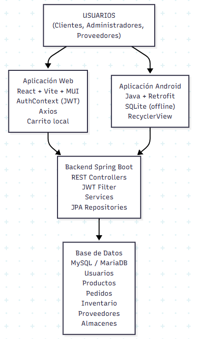
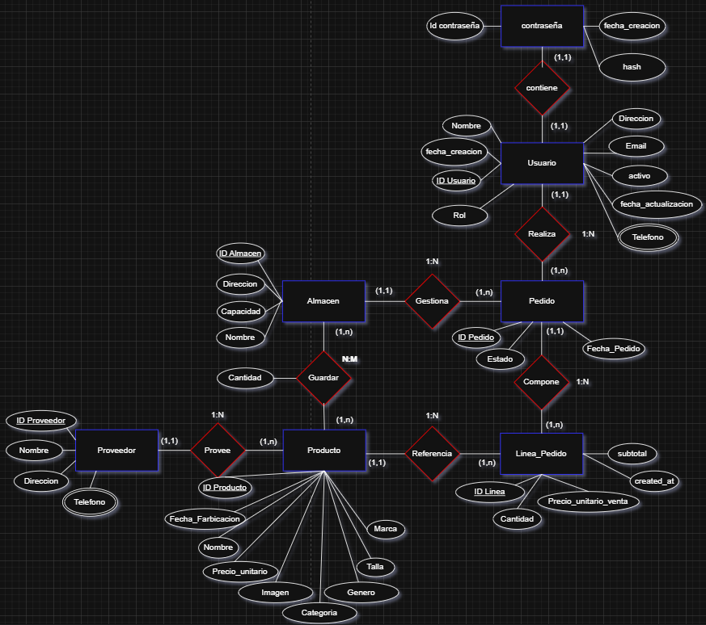
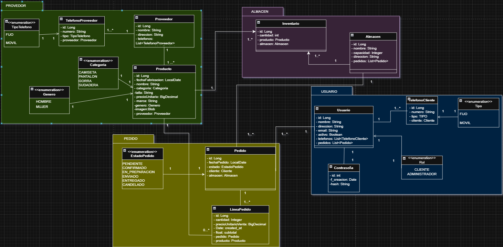

# GuatequeStore – Plataforma de moda sostenible con raíces canarias


> *"De la isla pa'l mundo, con ropa responsable y tecnología que funciona de cine."*

---

## 📖 Descripción del proyecto

Mira, chacho, GuatequeStore nació para dar respuesta a una necesidad concreta: el grupo musical **"El Guateque"** precisaba una plataforma de venta de merchandising que fuera completa, fácil de gestionar y orientada a la sostenibilidad. El proyecto aborda los siguientes objetivos:

- Los clientes registrados acceden al catálogo completo con precios, tallas, colores, marcas e imágenes, y pueden realizar pedidos directos sin necesidad de un carrito.
- Los visitantes disponen de un escaparate público con colecciones por temporada, sin precios ni tallas, orientado a incentivar el registro.
- Los administradores cuentan con un panel de control completo: gestión de productos, almacenes, proveedores, stock y pedidos.
- La plataforma funciona tanto en entorno web como en aplicación nativa Android.

Desde el punto de vista de la responsabilidad social, los proveedores cumplen estándares ESG y se ha implementado un **programa de reciclaje** mediante el cual los clientes pueden devolver prendas y obtener recompensas.

### Propósito principal

Desarrollar una solución de comercio electrónico completa que funcione con fluidez y sea fácil de mantener. El producto cubre tanto las necesidades del comprador como las del gestor de tienda, sin sobrecargar la arquitectura.

### Público objetivo

- **Clientes autenticados:** acceden al catálogo real con precios, tallas, marcas e imágenes.
- **Visitantes:** visualizan únicamente el escaparate público de inspiración y colecciones por temporada.
- **Administradores:** disponen de un panel con CRUD de productos, gestión de proveedores e inventario.
- **Usuarios móviles y de escritorio:** se benefician de una interfaz responsiva y accesible.

### Despliegue

- **Producción:** [https://guateque.yarcrasy.com/](https://guateque.yarcrasy.com/)
- El proyecto también puede ejecutarse localmente siguiendo las instrucciones de instalación de este documento.

---

## 📑 Tabla de contenidos

1. [Estado del proyecto](#-estado-del-proyecto)
2. [Tecnologías utilizadas](#-tecnologías-utilizadas)
3. [Arquitectura](#-arquitectura)
4. [Base de datos](#-base-de-datos)
5. [Diagrama UML](#-diagrama-uml)
6. [Instalación](#-instalación)
7. [Variables de entorno](#-variables-de-entorno)
8. [Endpoints de API](#-endpoints-de-api)
9. [Diseño y experiencia de usuario](#-diseño-y-experiencia-de-usuario)
10. [Accesibilidad](#-accesibilidad)
11. [Autenticación y seguridad](#-autenticación-y-seguridad)
12. [Testing](#-testing)
13. [Solución de problemas comunes (Troubleshooting)](#-solución-de-problemas-comunes-troubleshooting)
14. [Limitaciones conocidas](#-limitaciones-conocidas)
15. [Lecciones aprendidas](#-lecciones-aprendidas)
16. [Documentación completa](#-documentación-completa)
17. [Créditos, autores y licencia](#-créditos-autores-y-licencia)
18. [Conclusión](#-conclusión)

---

## ✅ Estado del proyecto

| Módulo | Funcionalidad | Estado |
|---|---|---|
| Autenticación | Registro con validación completa | ✅ Implementado |
| Autenticación | Login con JWT | ✅ Implementado |
| Autenticación | Gestión de sesión y logout | ✅ Implementado |
| Autenticación | Protección de rutas por rol | ✅ Implementado |
| Cliente | Catálogo real con precios y tallas | ✅ Implementado |
| Cliente | Pedido directo de productos (sin carrito) | ✅ Implementado |
| Cliente | Visualización de líneas de pedido en historial | ✅ Implementado |
| Cliente | Historial de pedidos | ✅ Implementado |
| Cliente | Programa de reciclaje | ✅ Implementado |
| Visitante | Escaparate público para visitantes | ✅ Implementado |
| Admin | Panel de control con métricas | ✅ Implementado |
| Admin | CRUD completo de productos | ✅ Implementado |
| Admin | Gestión de proveedores | ✅ Implementado |
| Admin | Gestión de almacenes | ✅ Implementado |
| Admin | Control de inventario | ✅ Implementado |
| Admin | Gestión de pedidos (cambio de estado) | ✅ Implementado |
| Admin | Gestión de clientes | ✅ Implementado |
| Técnicas | Diseño responsive mobile-first | ✅ Implementado |
| Técnicas | Testing automatizado con Vitest 3.x | ✅ Implementado |
| Técnicas | Build optimizado con Vite | ✅ Implementado |
| Android | App nativa con gestión de sesión | ✅ Implementado |
| Android | CRUD de proveedores desde móvil | ✅ Implementado |

---

## 🚀 Tecnologías utilizadas

| Capa | Tecnología | Uso |
|---|---|---|
| Backend Core | Java 17 | Lenguaje base |
| Backend Framework | Spring Boot 3.5.7 | Framework principal |
| Backend Seguridad | Spring Security + JWT | Autenticación y autorización |
| Backend Persistencia | JPA/Hibernate | ORM para MySQL |
| Backend Build | Gradle 8.14.3 | Gestión de dependencias |
| Database | MySQL 8.0 | Base de datos relacional |
| Frontend Core | React 19.2.0 | Interfaz declarativa y hooks |
| Frontend Build | Vite 7.2.4 | Build y desarrollo rápido |
| Frontend Routing | React Router DOM 6.30.3 | Enrutamiento y protección |
| Frontend UI | Material-UI (MUI) 7.3.7 | Componentes accesibles |
| Frontend HTTP | Axios 1.13.5 | Interceptores y JWT |
| Frontend Testing | Vitest 3.x + React Testing Library | Pruebas unitarias y cobertura |
| Android Language | Java 11 | Desarrollo nativo |
| Android Network | Retrofit 2.11.0 + GSON | Cliente HTTP |
| Android Storage | SharedPreferences | Sesión local con JWT |
| Android UI | ConstraintLayout + Material Components | Layouts responsivos |
| Herramientas | Git, GitHub, Postman, IntelliJ IDEA, Android Studio, XAMPP, Figma | — |

---

## 🧱 Arquitectura



La arquitectura sigue un patrón en capas bien definido:

- **Backend:** Separación en capa de controlador, servicio, repositorio y modelo. Esta separación facilita la escalabilidad, el mantenimiento y la cobertura de pruebas.
- **Frontend:** Componentes funcionales con React hooks, Context API para gestión del estado de autenticación y Axios interceptors para la gestión automática del token.
- **Android:** Activities, Adapters (RecyclerView), cliente Retrofit y SessionManager basado en SharedPreferences.

**Ventaja principal de esta arquitectura:** tanto la aplicación web como la móvil comparten las mismas APIs REST, lo que elimina duplicación de lógica de negocio y centraliza la seguridad en el backend.

---

## 🗄️ Base de datos



GuatequeStore utiliza MySQL 8 con las siguientes tablas principales:

| Tabla | Propósito |
|---|---|
| `usuarios` | Clientes y administradores (rol, activo, datos personales) |
| `contrasenas` | Hash BCrypt de contraseñas + relación 1:1 con usuario |
| `telefonos_usuarios` | Teléfonos asociados (varios por usuario) |
| `productos` | Catálogo completo (categoría, género, talla, precio, marca, imagen) |
| `proveedores` | Datos de suministradores |
| `almacenes` | Ubicaciones físicas (nombre, dirección, capacidad) |
| `inventarios` | Stock por almacén (relación N:M entre productos y almacenes) |
| `pedidos` | Cabeceras de pedido (fecha, estado, cliente, almacén) |
| `lineas_pedido` | Detalle de cada producto pedido (precio histórico, cantidad, subtotal) |

### Relaciones clave

- Un usuario tiene muchos pedidos.
- Un pedido contiene muchas líneas de pedido.
- Cada línea de pedido almacena el **precio histórico** del producto en el momento de la compra, garantizando la integridad del registro aunque el precio cambie posteriormente.
- Un producto puede estar en varios almacenes (control de stock por inventario).
- Cada producto pertenece a un proveedor.

> **Nota de consistencia:** El enum `estado_pedido` utiliza el valor `EN_PREPARACION` (con guion bajo, sin tilde) tanto en el modelo Java como en la base de datos MySQL, para garantizar la compatibilidad entre ambas capas.

---

## 📐 Diagrama UML



---

## 🛠️ Instalación

### Requisitos previos

- Java 17 o superior
- Node.js 18 o superior
- MySQL 8.0
- Git
- *(Opcional)* Android Studio para la aplicación móvil

### Backend – Paso a paso

```bash
# 1. Clonar el repositorio
git clone https://github.com/Adrianbien43/GuatequeStore.git
cd GuatequeStore/Backend

# 2. Crear la base de datos
mysql -u root -p
CREATE DATABASE guatequestore;
EXIT;

# 3. Configurar application.properties
# Editar src/main/resources/application.properties con las credenciales del entorno

# 4. Compilar y ejecutar
./gradlew clean build
./gradlew bootRun
```

El backend quedará disponible en `http://localhost:8080`.

> **Nota:** En el primer arranque, Spring Boot conecta con MySQL, crea todas las tablas automáticamente y genera un usuario administrador con las siguientes credenciales por defecto:
> - **Email:** `admin@admin.com`
> - **Contraseña:** `Admin1234!`
> - **Rol:** `ADMINISTRADOR`
>
> Se recomienda cambiar estas credenciales antes de desplegar en producción.

### Frontend – Paso a paso

```bash
# 1. Acceder a la carpeta del frontend
cd ../Frontend

# 2. Instalar dependencias
npm install

# 3. Configurar variables de entorno
cp .env.example .env
# Editar .env con la URL del backend correspondiente

# 4. Iniciar en modo desarrollo
npm run dev
```

La aplicación web estará disponible en `http://localhost:5173`.

### Android – Paso a paso

```bash
# 1. Abrir Android Studio
File → Open → GuatequeStore/Android

# 2. Esperar a que Gradle sincronice las dependencias

# 3. Configurar la URL del backend en ApiClient.java
#    Emulador:          http://10.0.2.2:8080/api
#    Dispositivo físico: http://TU_IP_LOCAL:8080/api

# 4. Conectar un dispositivo físico o crear un emulador (API 24+)

# 5. Ejecutar la aplicación
Run → Run 'app'
```

> **Nota sobre `cleartextTraffic`:** El archivo `AndroidManifest.xml` incluye `android:usesCleartextTraffic="true"` para permitir conexiones HTTP no cifradas durante el desarrollo local. Esta configuración **debe deshabilitarse en producción**, donde la comunicación con el servidor debe realizarse exclusivamente a través de HTTPS. Para ello, se elimina el atributo o se establece a `false` en el manifest de producción.

#### Configuración clave de `ApiClient.java`

A continuación se muestra la configuración esencial del cliente Retrofit:

```java
public class ApiClient {
    private static final String BASE_URL_EMULATOR = "http://10.0.2.2:8080/api/";
    // Para dispositivo físico: "http://TU_IP_LOCAL:8080/api/"

    private static Retrofit retrofit = null;

    public static Retrofit getClient(Context context) {
        if (retrofit == null) {
            String token = SessionManager.getInstance(context).getToken();

            OkHttpClient httpClient = new OkHttpClient.Builder()
                .addInterceptor(chain -> {
                    Request original = chain.request();
                    Request.Builder builder = original.newBuilder();
                    if (token != null && !token.isEmpty()) {
                        builder.header("Authorization", "Bearer " + token);
                    }
                    return chain.proceed(builder.build());
                })
                .build();

            retrofit = new Retrofit.Builder()
                .baseUrl(BASE_URL_EMULATOR)
                .addConverterFactory(GsonConverterFactory.create())
                .client(httpClient)
                .build();
        }
        return retrofit;
    }

    // Invalida la instancia al cerrar sesión
    public static void reset() {
        retrofit = null;
    }
}
```

### Comandos disponibles (Frontend)

| Comando | Descripción |
|---|---|
| `npm run dev` | Inicia el servidor de desarrollo |
| `npm run build` | Genera la build de producción |
| `npm run preview` | Sirve la build de producción localmente |
| `npm run test` | Ejecuta las pruebas unitarias con Vitest |
| `npm run test:coverage` | Genera el reporte de cobertura (HTML en `/coverage`) |
| `npm run lint` | Ejecuta ESLint |

---

## 🔧 Variables de entorno

### Frontend (`.env`)

```env
VITE_API_BASE_URL=http://localhost:8080/api
VITE_JWT_STORAGE_KEY=token
VITE_USER_STORAGE_KEY=user
```

### Backend (`application.properties`)

```properties
spring.datasource.url=jdbc:mysql://localhost:3306/guatequestore
spring.datasource.username=root
spring.datasource.password=tu_contraseña
spring.jpa.hibernate.ddl-auto=update
```

---

## 📡 Endpoints de API

### Base URL

- **Desarrollo local:** `http://localhost:8080/api`
- **Producción:** `https://guateque.yarcrasy.com/api`

### Autenticación (`/api/auth`)

| Método | Endpoint | Descripción |
|---|---|---|
| POST | `/login` | Iniciar sesión y obtener JWT |
| POST | `/register` | Registrar nuevo usuario |
| POST | `/validate` | Validar token JWT |

### Productos (`/api/productos`)

| Método | Endpoint | Descripción | Rol |
|---|---|---|---|
| GET | `/` | Listar todos los productos | CLIENTE/ADMIN |
| GET | `/{id}` | Obtener detalle de producto | CLIENTE/ADMIN |
| POST | `/` | Crear nuevo producto | ADMIN |
| PUT | `/{id}` | Actualizar producto | ADMIN |
| DELETE | `/{id}` | Eliminar producto | ADMIN |

### Pedidos (`/api/pedidos`)

| Método | Endpoint | Descripción | Rol |
|---|---|---|---|
| GET | `/` | Listar todos los pedidos | ADMIN |
| GET | `/{id}` | Obtener detalle de pedido | CLIENTE/ADMIN |
| GET | `/cliente/{usuarioId}` | Pedidos del cliente | CLIENTE/ADMIN |
| POST | `/` | Crear nuevo pedido | CLIENTE |
| PUT | `/{id}` | Actualizar estado del pedido | ADMIN |
| DELETE | `/{id}` | Eliminar pedido | ADMIN |

### Proveedores (`/api/proveedores`)

| Método | Endpoint | Descripción | Rol |
|---|---|---|---|
| GET | `/` | Listar proveedores | CLIENTE/ADMIN |
| GET | `/{id}` | Obtener proveedor | CLIENTE/ADMIN |
| GET | `/{id}/productos` | Productos del proveedor | CLIENTE/ADMIN |
| POST | `/` | Crear proveedor | ADMIN |
| PUT | `/{id}` | Actualizar proveedor | ADMIN |
| DELETE | `/{id}` | Eliminar proveedor | ADMIN |

### Almacenes (`/api/almacenes`)

| Método | Endpoint | Descripción | Rol |
|---|---|---|---|
| GET | `/` | Listar almacenes | ADMIN |
| GET | `/{id}` | Obtener almacén | ADMIN |
| POST | `/` | Crear almacén | ADMIN |
| PUT | `/{id}` | Actualizar almacén | ADMIN |
| DELETE | `/{id}` | Eliminar almacén | ADMIN |

### Inventario (`/api/inventario`)

| Método | Endpoint | Descripción | Rol |
|---|---|---|---|
| GET | `/` | Listar todo el inventario | ADMIN |
| GET | `/almacen/{almacenId}` | Stock por almacén | ADMIN |
| GET | `/producto/{productoId}` | Stock por producto | ADMIN |
| GET | `/bajo-stock/{limite}` | Productos con stock bajo | ADMIN |
| POST | `/` | Asociar producto a almacén | ADMIN |
| PUT | `/almacen/{aId}/producto/{pId}` | Actualizar cantidad en inventario | ADMIN |

### Usuarios (`/api/usuarios`)

| Método | Endpoint | Descripción | Rol |
|---|---|---|---|
| GET | `/` | Listar usuarios | ADMIN |
| GET | `/{id}` | Obtener usuario | CLIENTE/ADMIN |
| POST | `/` | Crear usuario | ADMIN |
| PUT | `/{id}` | Actualizar usuario | ADMIN |
| DELETE | `/{id}` | Eliminar usuario | ADMIN |

### Códigos de respuesta HTTP

| Código | Significado |
|---|---|
| `200 OK` | Petición procesada correctamente |
| `201 CREATED` | Recurso creado con éxito |
| `204 NO CONTENT` | Eliminación realizada correctamente |
| `400 BAD REQUEST` | Datos de entrada inválidos |
| `401 UNAUTHORIZED` | Token no proporcionado o inválido |
| `403 FORBIDDEN` | Permisos insuficientes para el recurso |
| `404 NOT FOUND` | Recurso no encontrado |

---

## 🎨 Diseño y experiencia de usuario

### Intención de diseño

La paleta de colores se definió para transmitir cercanía y confianza. Se optó por una gama basada en verdes suaves y acentos neutros que refuerzan los valores de sostenibilidad y crecimiento del proyecto.

La tipografía se seleccionó para facilitar la lectura y distinguir con claridad los bloques de información. Se utilizaron tamaños escalables para mejorar la experiencia en móviles y tablets.

### Breakpoints responsive

| Nombre | Min-width | Uso típico |
|---|---|---|
| xs | 0px | Móvil portrait |
| sm | 600px | Móvil landscape |
| md | 960px | Tablet |
| lg | 1280px | Desktop |
| xl | 1920px | Monitor grande |

### Usabilidad (heurísticas de Nielsen)

Se han aplicado los 10 principios de Jakob Nielsen:

1. **Visibilidad del estado del sistema:** Indicadores de carga y mensajes de confirmación.
2. **Relación con el mundo real:** Lenguaje claro e iconos intuitivos.
3. **Control y libertad:** Botones de cancelar y confirmaciones antes de acciones críticas.
4. **Consistencia y estándares:** Colores uniformes y botones coherentes en toda la interfaz.
5. **Prevención de errores:** Validaciones en tiempo real en los formularios.
6. **Reconocimiento antes que recuerdo:** Opciones visibles y accesibles sin necesidad de memorización.
7. **Flexibilidad y eficiencia:** Accesos directos para usuarios avanzados.
8. **Diseño estético y minimalista:** Sin sobrecarga visual; solo la información relevante.
9. **Recuperación de errores:** Mensajes claros con indicación de la solución.
10. **Ayuda y documentación:** Manuales completos disponibles para todos los perfiles.

---

## ♿ Accesibilidad

### Cumplimiento WCAG 2.1 AA

Se han verificado los principales puntos de accesibilidad:

- **Perceptible:** Contraste adecuado, textos claros e información no dependiente únicamente del color.
- **Operable:** Botones con tamaño adecuado, navegación por teclado completa y sin animaciones peligrosas.
- **Comprensible:** Lenguaje sencillo, navegación consistente y formularios correctamente estructurados.
- **Robusto:** HTML semántico (`header`, `nav`, `main`, `footer`), etiquetas asociadas a campos y textos alternativos en imágenes.

### Herramientas de verificación

- **Figma** para prototipado y diseño accesible.
- **Lighthouse** para evaluación de accesibilidad y buenas prácticas.

---

## 🔐 Autenticación y seguridad

### Flujo JWT

1. El usuario envía sus credenciales al endpoint `/api/auth/login`.
2. El backend valida las credenciales y devuelve un token JWT firmado con validez de 24 horas.
3. El token se almacena en `localStorage` (web) o `SharedPreferences` (Android).
4. Cada petición posterior incluye la cabecera `Authorization: Bearer <token>`.
5. Al expirar el token, se fuerza el cierre de sesión y se redirige al usuario al login.

### Roles y protección

- **CLIENTE:** Acceso al catálogo real, realización de pedidos e historial personal.
- **ADMINISTRADOR:** Acceso completo al panel de gestión de la plataforma.

### Medidas de seguridad adicionales

- Contraseñas hasheadas con BCrypt.
- Usuarios desactivables (no se eliminan de la base de datos para preservar el historial).
- CORS configurado para orígenes específicos.
- Transacciones ACID en operaciones críticas.

---

## 🧪 Testing

### Frontend (89 tests) – Vitest 3.x + React Testing Library

El reporte de cobertura se genera ejecutando `npm run test:coverage`. Los resultados se publican en formato HTML en la carpeta `/coverage/index.html`.

| Categoría | Tests |
|---|---|
| Lógica de validación | 27 |
| API y servicios | 9 |
| Contexto de autenticación | 8 |
| Componentes | 15 |
| Interfaz de usuario | 29 |
| Verificación | 1 |

**Resultado: ✅ 89 passed (0 failed, 0 skipped)**

### Backend

Las pruebas del backend cubren los siguientes escenarios:

- Autenticación y obtención de token JWT.
- CRUD completo de proveedores.
- Verificación de integridad referencial entre entidades.
- Pruebas de conexión y consultas a la base de datos.

---

## 🛟 Solución de problemas comunes (Troubleshooting)

| # | Problema | Posible causa | Solución |
|---|---|---|---|
| 1 | **El backend no inicia:** `Connection refused` | MySQL no está corriendo o las credenciales son incorrectas | Asegurar que MySQL está corriendo y revisar `spring.datasource.*` en `application.properties` |
| 2 | **Frontend no se conecta al backend:** Error CORS | Puertos incorrectos o CORS no configurado | Verificar que el backend corre en `8080` y el frontend en `5173`. Revisar configuración CORS en el backend |
| 3 | **Android muestra "Connection refused"** | URL del backend mal configurada | En emulador usar `http://10.0.2.2:8080/api`; en dispositivo físico usar la IP real de la máquina |
| 4 | **Token expirado después de 24 horas** | El JWT tiene validez limitada | El usuario debe hacer login nuevamente para obtener un token fresco |

---

## ⚠️ Limitaciones conocidas

1. El modelo de compra es **directo** (sin carrito). Esto responde a la naturaleza del proyecto (grupo musical emergente), pero a futuro se valorará incorporar un carrito completo.
2. No hay **pasarela de pago integrada**. Los pedidos se registran como `PENDIENTE` y el administrador contacta al cliente por correo para tramitar el pago.
3. La **búsqueda** funciona por nombre de producto; no se ha extendido a descripción.
4. Las **imágenes** de productos no se suben dinámicamente desde el panel (próxima mejora).

---

## 📚 Lecciones aprendidas

A lo largo del desarrollo se ha priorizado la mantenibilidad sin sacrificar funcionalidad. El mayor reto fue encontrar el nivel de abstracción adecuado para cada capa.

**Dificultades superadas:**

- Implementar correctamente las líneas de pedido con precio histórico.
- Configurar Spring Security con JWT y roles diferenciados.
- Gestionar la tabla intermedia de Inventario con relación N:M.
- Sincronizar el desarrollo simultáneo de frontend, backend y aplicación Android.

En una hipotética nueva iteración, se dedicaría más tiempo al diseño del estado global y a la estrategia de gestión de datos desde el inicio del proyecto.

---

## 📄 Documentación completa

Además de este README, el proyecto cuenta con documentación extensa:

| Documento | Ruta |
|---|---|
| Manual Técnico | `./docs/Manual_Tecnico.pdf` |
| Manual de Usuario | `./docs/Manual_Usuario.pdf` |
| Plan de Empresa (FOL) | `./docs/FOL_Plan_Empresa_GuatequeStore.pdf` |
| SSG – Sistemas de Gestión Empresarial | `./docs/SSG_Documentacion_Intermodular.pdf` |
| Python – Procesamiento de datos | `./docs/PYTHON_GuatequeStore.pdf` |
| Cloud Computing – AWS | `./docs/Cloud_Computing_AWS.pdf` |
| Sostenibilidad (primera entrega) | `./docs/Sostenibilidad_GuatequeStore_Entrega_Anterior.pdf` |
| Sostenibilidad (última entrega) | `./docs/Sostenibilidad_GuatequeStore_Ultima_Entrega.pdf` |
| Diseño en Figma | [https://www.figma.com/design/vbEG6WmzHaxsk2JROq9KnC/KORA-DESIGN](https://www.figma.com/design/vbEG6WmzHaxsk2JROq9KnC/KORA-DESIGN) |

---

## 🙏 Créditos, autores y licencia

**Autores:**
- Adrián Bienvenido Morales Perdomo – `adrianbienvenidomoralesperdomo@alumno.ieselrincon.es`
- Gorka Jesús Quesada Vega – `gorkajesusquesadavega@alumno.ieselrincon.es`

**Centro:** IES El Rincón – 2º DAM (Desarrollo de Aplicaciones Multiplataforma)  
**Curso:** 2025/2026

**Repositorio:** [https://github.com/Adrianbien43/GuatequeStore.git](https://github.com/Adrianbien43/GuatequeStore.git)  
**Web producción:** [https://guateque.yarcrasy.com/](https://guateque.yarcrasy.com/)

**Licencia:** MIT License

---

## 🎤 Conclusión

GuatequeStore es el resultado de meses de trabajo, aprendizaje y dedicación. La plataforma integra backend, frontend web y aplicación Android, con un enfoque claro en la moda sostenible y la economía circular.

El proyecto ha supuesto un ejercicio completo de ingeniería de software: desde el diseño de la base de datos y la arquitectura de la API, hasta la experiencia de usuario en web y móvil. Cada decisión técnica ha sido tomada con criterio de mantenibilidad y escalabilidad.

> *"La ropa mola, el software funciona y el equipo se parte la cara. Eso es GuatequeStore, chacho."*  
> — Adrián & Gorka